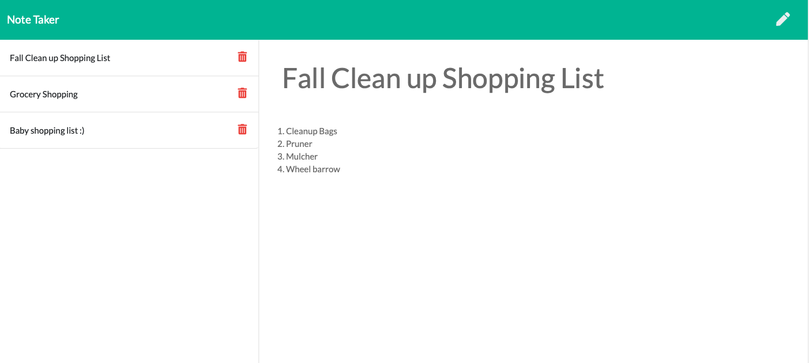

# NoteTaker
application called Note Taker that can be used to write and save notes. This application will use an Express.js back end and will save and retrieve note data from a JSON file.
# Table-of-Contents
  * [Deployed URL](#deployed-url)
  * [Git Repo](#git-repo)
  * [Dependency](#dependency)
  * [UserStory](#userstory)
  * [Acceptance Criteria](#acceptance-criteria)
  * [Application Invoked](#application-invoked)
  * [Screenshots](#screenshots)


 
## [Deployed URL](#table-of-contents)
```
  heroku: https://note-takers2022.herokuapp.com
  gitHub:  https://kabirfaisal1.github.io/NoteTaker/
```
## [Git Repo](#table-of-contents)
```
   https://github.com/kabirfaisal1/NoteTaker.git
```

## [Dependency](#table-of-contents)
```
    1. node.js (npm install -g npm) on your system
    2. Express.js
```
## [User Story](#table-of-contents)
```
AS A small business owner
I WANT to be able to write and save notes
SO THAT I can organize my thoughts and keep track of tasks I need to complete
```

## [Acceptance Criteria](#table-of-contents)
```
GIVEN a note-taking application
WHEN I open the Note Taker
THEN I am presented with a landing page with a link to a notes page
WHEN I click on the link to the notes page
THEN I am presented with a page with existing notes listed in the left-hand column, plus empty fields to enter a new note title and the note’s text in the right-hand column
WHEN I enter a new note title and the note’s text
THEN a Save icon appears in the navigation at the top of the page
WHEN I click on the Save icon
THEN the new note I have entered is saved and appears in the left-hand column with the other existing notes
WHEN I click on an existing note in the list in the left-hand column
THEN that note appears in the right-hand column
WHEN I click on the Write icon in the navigation at the top of the page
THEN I am presented with empty fields to enter a new note title and the note’s text in the right-hand column
```

## [Application Invoked](#table-of-contents)
```
node [your node app]
```

## [Screenshots](#table-of-contents)


